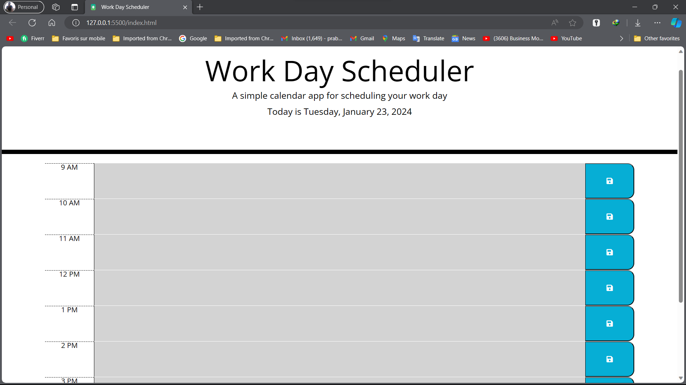

# Daily Planner App

Streamline your day with our user-friendly calendar. Easily add, manage, and track your daily events. Stay organized effortlessly.

## Overview

This is a simple calendar application that allows users to save events for each hour of the day. The app is built using HTML, CSS, JavaScript, jQuery, and leverages the Day.js library for working with date and time.

## Features

- Display the current day at the top of the calendar when a user opens the planner.
- Present timeblocks for standard business hours when the user scrolls down.
- Color-code each timeblock based on past, present, and future when the timeblock is viewed.
- Allow a user to enter an event when they click a timeblock.
- Save the event in local storage when the save button is clicked in that timeblock.
- Persist events between refreshes of a page.

## Mock-Up



## Getting Started

1. Clone the repository:

   - Using HTTPS:
     ```bash
     git clone https://github.com/prabud0401/DailyPlannerApp.git
     ```

   - Using SSH:
     ```bash
     git clone git@github.com:prabud0401/DailyPlannerApp.git
     ```

2. Open the `index.html` file in your browser.

## Usage

- Click on the timeblocks to enter or edit events.
- Click the save button to save events to local storage.
- Refresh the page, and your saved events will persist.

## Deployed Application

Access the deployed application [here](https://prabud0401.github.io/DailyPlannerApp/).

## License

This project is licensed under the MIT License - see the [LICENSE.md](LICENSE.md) file for details.

## Acknowledgments

- Thanks to the creators of Day.js for the powerful date and time library.
